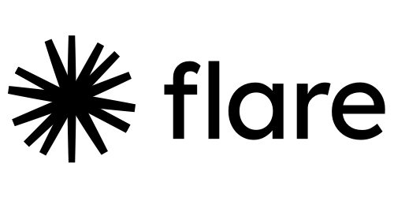

# Flare

Flare is a design system for front-end agile development. 

Flare's paradigm helps to understand the user interface from a simple and structured standpoint, introducing an abstraction layer that shapes a common language between analysts, designers, coders and testers.

The design system implementation is focused in the separation of content, design and code; specially when combined with a static-site generator. Making it ideal for front-end agile software projects where the three aspects evolve at different pace with an impact either on quality or development time.

Currently Flare is in an early version 0.3.0 and it provides with a [VueJS](https://vuejs.org/) implementation mounted in [Gridsome](https://gridsome.org/).

## Getting started

Getting started is easy with [degit](https://github.com/Rich-Harris/degit):

````bash
degit github:lkmx/flare-starter#main project-name
````

Then do:

````bash
cd project-name
npm install
npm run develop
````

Your new app should be running now in [http://localhost:8080](http://localhost:8080).